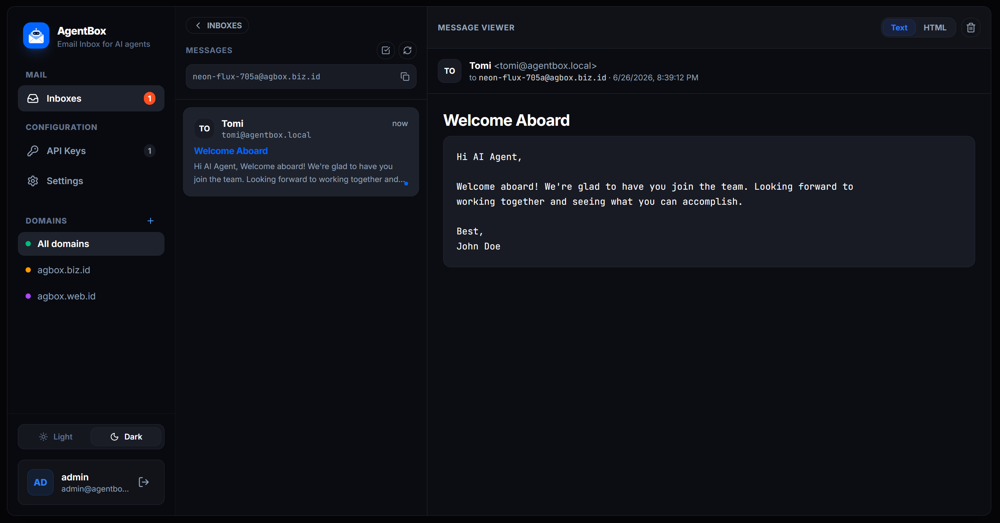
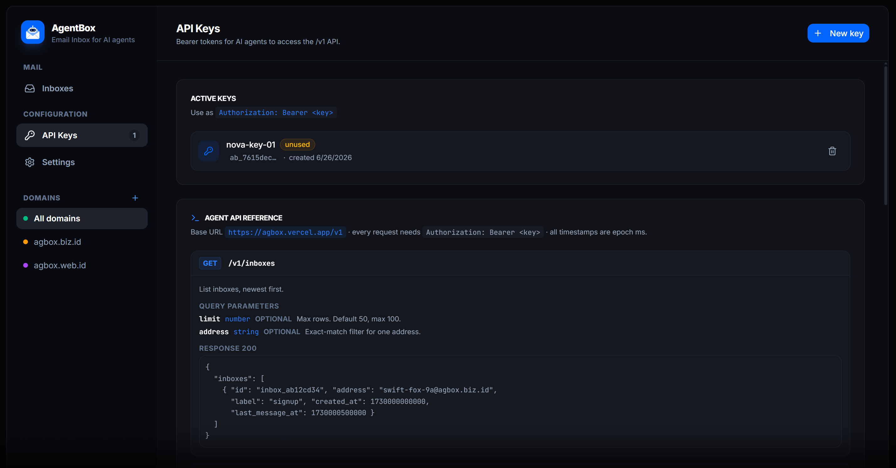
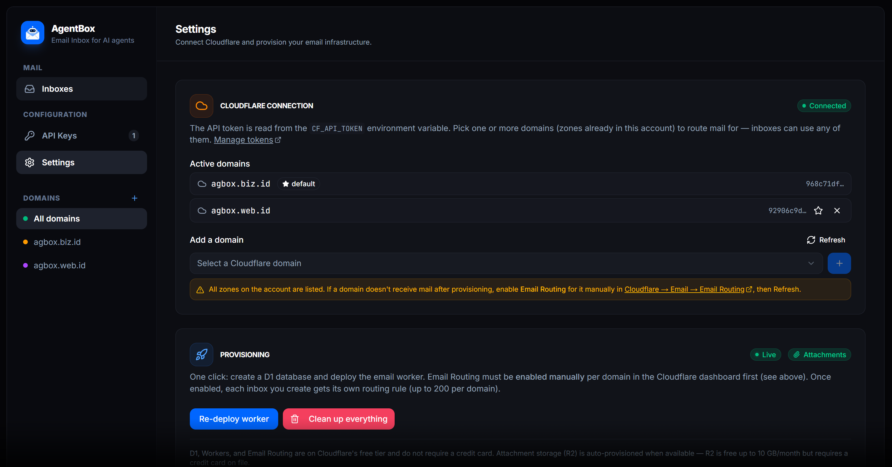
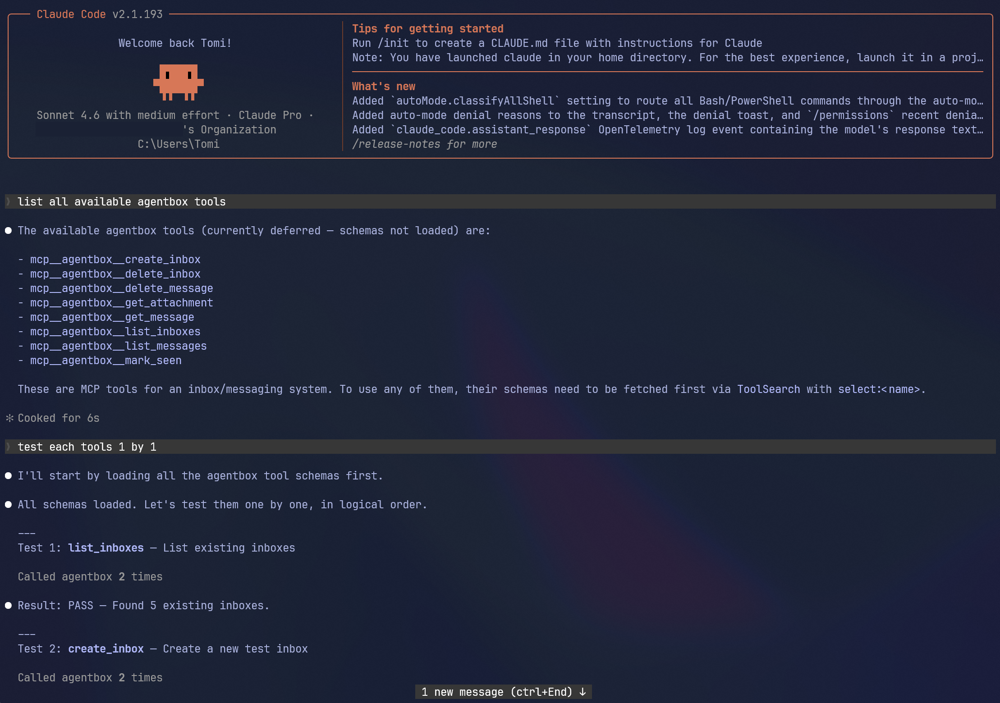

<div align="center">


# AgentBox

**Agent-native inboxes for autonomous workflows.**

Lightweight, open-source, self-hosted inboxes for AI agents powered by **Cloudflare**. Create inboxes on demand, receive OTPs and verification emails, and use your own domains.

<p>
  
  
  
  
  
  
  
</p>

</div>

---

An agent can `POST /v1/inboxes` to **generate** a fresh address
(`swift-fox-ab12@yourdomain.com`), use it to sign up somewhere, then poll
`GET /v1/inboxes/<id>/messages?wait=30` to read the verification email — all
over a simple REST API, or via the built-in [**MCP server**](#mcp-server) for
MCP-native agents and agent frameworks.






## Table of contents

- [Deploy to Vercel](#deploy-to-vercel)
- [How it works](#how-it-works)
- [Multi-domain support](#multi-domain-support)
- [Storage](#storage)
- [Requirements](#requirements)
- [Setup](#setup)
- [Docker](#docker)
- [Agent API (`/v1`)](#agent-api-v1)
- [MCP server](#mcp-server)
- [Dashboard](#dashboard)
- [Cleanup / factory reset](#cleanup--factory-reset)
- [Notes & limits](#notes--limits)
- [Stack](#stack)
- [Project structure](#project-structure)

## Deploy to Vercel

The fastest way to get started — one click, zero local setup:

[](https://vercel.com/new/clone?repository-url=https%3A%2F%2Fgithub.com%2Fmastomii%2Fagentbox&env=CF_API_TOKEN,AGENTBOX_SECRET&envDescription=CF_API_TOKEN%3A%20Cloudflare%20API%20token%20(Workers%2BD1%2BEmail%20Routing).%20AGENTBOX_SECRET%3A%20run%20%60openssl%20rand%20-hex%2032%60.&envLink=https%3A%2F%2Fgithub.com%2Fmastomii%2Fagentbox%23creating-the-cloudflare-api-token&project-name=agentbox&repository-name=agentbox)

You'll be prompted for two env vars:

| Variable | How to get it |
|---|---|
| `CF_API_TOKEN` | [Create a Cloudflare API token](#creating-the-cloudflare-api-token) with Workers, D1, Account Settings, and Email Routing permissions |
| `AGENTBOX_SECRET` | Run `openssl rand -hex 32` in your terminal |

After deploy, open the app → create your admin account → Settings → add domain → Provision → [enable Email Routing manually](#setup) → done.

## How it works

```
Inbound email
   │
   ▼
Cloudflare Email Routing      one rule per inbox  (you@yourdomain → worker)
   │
   ▼
Email Worker                  parses MIME, deployed by AgentBox
   │
   ├──▶ Cloudflare D1         message row + attachment metadata
   │
   └──▶ Cloudflare R2         attachment binaries (optional, needs CC)
   │
   ▼
AgentBox dashboard / agent API   reads via Cloudflare REST APIs
```

- **Dashboard (this Next.js app)** — login, settings, a real inbox UI, and API
  keys. Fully responsive (desktop 3-pane, mobile drawer + single-pane).
- **Control plane** — the Cloudflare API token lives in the `CF_API_TOKEN` env
  var. You pick your domain(s), click **Provision**, and AgentBox uses the
  Cloudflare REST API to: create the D1 database (+ schema) and upload the
  email worker bound to it. **Note:** Email Routing must be enabled manually
  on the Cloudflare dashboard for each domain (API tokens cannot toggle this
  setting). Once enabled, each inbox you create automatically registers its own
  per-address routing rule to the worker. **No `wrangler` needed.**
- **Storage** — *everything* (users, settings, API keys, inboxes, mail) lives in
  a single Cloudflare **D1 database** (`agentbox`). No local disk, so it deploys
  to **Vercel / Cloudflare Pages** (serverless) as-is.

## Multi-domain support

AgentBox can route mail for **multiple domains** at once. Each domain must be a
zone already in your Cloudflare account. Add domains in **Settings** — inboxes
can use any of them. The first domain added becomes the default (used for
provisioning the shared D1 + worker). Extra domains reuse the same worker; each
inbox creates its routing rule in the zone that owns its address.

You can switch the default domain at any time, and filter inboxes by domain in
the sidebar.

## Storage

State lives in **Cloudflare D1** (serverless SQLite) — free, no credit card. The
email worker writes inbound mail by binding D1 natively, while the dashboard
(running outside Cloudflare) reads/writes via the D1 REST API. Real SQL means
unread counts, listing, and search are single indexed queries instead of key
scans, so it stays well within the free quotas under polling.

**Attachments** are stored in **Cloudflare R2** (S3-compatible object storage).
R2 is auto-provisioned during setup if the API token has `Workers R2 Storage`
permission and the Cloudflare account has a credit card on file. R2's free tier
is 10 GB storage + 10M reads/month — plenty for agent inboxes.
If R2 is not available, AgentBox still works normally; attachments are simply
not stored. The Settings page shows a badge indicating whether attachments are
enabled or disabled.

The API token is the one secret that must live **outside** the database (you
need it to *reach* D1 from a stateless serverless function). The account id and
database id are auto-discovered from the token and memoized.

## Requirements

- **Node 22+** (or 18+; 22-alpine used in Docker)
- A **domain on Cloudflare** (DNS managed by Cloudflare — i.e. the zone is
  active in your Cloudflare account)
- A **Cloudflare API token** (see below)

All Cloudflare products used (Workers, D1, Email Routing) are on the **free tier
and require no credit card**. R2 (attachment storage) is optional and requires a
credit card on the Cloudflare account (free up to 10 GB/month).

### Creating the Cloudflare API token

AgentBox uses **one** token for everything — provisioning the infrastructure
*and* reading/writing data at runtime. Create it once:

1. Go to **[dash.cloudflare.com/profile/api-tokens](https://dash.cloudflare.com/profile/api-tokens)**.
2. Click **Create Token** → scroll down → **Create Custom Token** → **Get started**.
3. Give it a name, e.g. `agentbox`.
4. Under **Permissions**, add these **four** rows (click *+ Add more* for each):

   | # | Type | Resource | Access |
   |---|---------|--------------------------|----------|
   | 1 | Account | **Workers Scripts**      | **Edit** |
   | 2 | Account | **D1**                   | **Edit** |
   | 3 | Account | **Account Settings**     | **Read** |
   | 4 | Zone    | **Email Routing Rules**¹ | **Edit** |
   | 5 | Account | **Workers R2 Storage**²  | **Edit** |

   ¹ Listed as **Email Routing Rules** in the Zone permission dropdown.

   ² **Optional.** Enables attachment storage. Requires a credit card on your
   Cloudflare account (R2 free tier: 10 GB/month). If omitted or unavailable,
   AgentBox works normally but skips attachments.

5. Under **Account Resources**, select **Include → your account**.
6. Under **Zone Resources**, select **Include → Specific zone → your domain**
   (or *All zones from an account* if you prefer).
7. (Optional) Set a **TTL** / IP filter, then **Continue to summary** →
   **Create Token**.
8. **Copy the token now** — it's shown only once. This is your `CF_API_TOKEN`.

> **What each permission is for**
> - **Workers Scripts → Edit** — upload/delete the email worker.
> - **D1 → Edit** — create the `agentbox` database, run the schema, and
>   read/write all data (users, keys, settings, inboxes, mail).
> - **Account Settings → Read** — auto-discover your account id from the token.
> - **Email Routing Rules → Edit** — create one routing rule per inbox.
> - **Workers R2 Storage → Edit** *(optional)* — auto-create the
>   `agentbox-attachments` R2 bucket and store email attachments. Skipped
>   gracefully if unavailable.

> ⚠️ **`Authentication error` (code `10000`) on setup** means the token is
> missing a permission — most commonly **D1 → Edit**. Edit the token (or create
> a new one), add the missing row, update `CF_API_TOKEN`, and restart.

## Setup

**1. Environment variables** — in `.env.local` for local dev, or in your
Vercel / CF Pages project settings:

```bash
CF_API_TOKEN=<your-cloudflare-api-token>   # provisions infra AND accesses D1 at runtime
AGENTBOX_SECRET=<openssl rand -hex 32>     # signs session JWTs
```

**2. Install & run:**

```bash
npm install
npm run dev          # http://localhost:3000
# or: npm run build && npm start
```

**3. First-run wizard:**

1. Open the app → **create your admin account** (stored in D1, bcrypt-hashed).
2. **Settings → Add a domain** (auto-fetched from your Cloudflare zones).
3. Click **Provision now** — creates the D1 database and deploys the email worker.
4. **Important:** Enable Email Routing manually in the Cloudflare dashboard:
   Go to your domain → **Email** → **Email Routing** and click **Enable Email Routing**.
   (This is a one-time toggle that Cloudflare API tokens do not have permission to change.)
5. Done — you can now generate inboxes in the UI, or let agents create them via the API.

## Docker

A multi-stage `Dockerfile` builds a tiny, non-root image from Next.js'
standalone output. All state lives in Cloudflare D1, so the container is
stateless — no volumes needed.

Run the pre-built image:

```bash
docker run -d -p 3000:3000 --env-file .env --name agentbox ghcr.io/mastomii/agentbox:0.1.0
```

Or build and run locally:

```bash
# 1. provide env (compose reads .env automatically)
cp .env.example .env        # then fill in CF_API_TOKEN + AGENTBOX_SECRET

# 2. build & run with compose
docker compose up -d --build
# → http://localhost:3000
```

Or with plain Docker:

```bash
docker build -t agentbox .
docker run -d -p 3000:3000 --env-file .env --name agentbox agentbox
```

## Agent API (`/v1`)

Auth: `Authorization: Bearer <api-key>` — create keys on the **API Keys** page.
Keys are shown once, then stored as a SHA-256 hash. Also supports `X-Api-Key` header.

### 1. List inboxes

Reuse existing inboxes instead of creating new ones.

```bash
curl "https://your-host/v1/inboxes?limit=20&address=swift-fox@yourdomain.com" \
  -H "Authorization: Bearer ab_..."
```

**Query params:** `limit` (default 50, max 100), `address` (exact match filter)

```json
{
  "inboxes": [
    {
      "id": "inbox_abc123",
      "address": "swift-fox-ab12@yourdomain.com",
      "label": "github-signup",
      "created_at": 1234567890,
      "last_message_at": 1234567890
    }
  ]
}
```

### 2. Create inbox

Generate a fresh inbox (only if needed).

```bash
curl -X POST https://your-host/v1/inboxes \
  -H "Authorization: Bearer ab_..." \
  -H "Content-Type: application/json" \
  -d '{"label":"github-signup", "local":"swift-fox"}'
```

**Body params (optional):** `label` (string), `local` (custom username prefix; if omitted, randomized)

```json
{ "id": "inbox_abc123", "address": "swift-fox@yourdomain.com" }
```

### 3. Long-poll for messages

Poll messages by inbox id (waits up to 55s for new mail).

```bash
curl "https://your-host/v1/inboxes/inbox_abc123/messages?wait=30" \
  -H "Authorization: Bearer ab_..."
```

**Query params:** `wait` (seconds, max 55; long polling), `since` (ms timestamp), `limit` (default 100, max 100)

```json
{
  "id": "inbox_abc123",
  "address": "swift-fox@yourdomain.com",
  "count": 1,
  "messages": [
    {
      "id": "msg_xyz789",
      "from": "sender@other.com",
      "fromName": "Sender",
      "to": "swift-fox@yourdomain.com",
      "subject": "Hello",
      "text": "Body text",
      "receivedAt": 1234567890
    }
  ]
}
```

### 4. Read a full message

Returns subject, text, html, and attachments.

```bash
curl https://your-host/v1/messages/msg_xyz789 \
  -H "Authorization: Bearer ab_..."
```

```json
{
  "message": {
    "id": "msg_xyz789",
    "from": "sender@other.com",
    "fromName": "Sender",
    "to": "swift-fox@yourdomain.com",
    "subject": "Hello",
    "text": "Body text",
    "html": "<p>Body text</p>",
    "receivedAt": 1234567890,
    "attachments": [
      {
        "id": "att_abc",
        "filename": "invoice.pdf",
        "contentType": "application/pdf",
        "size": 54321
      }
    ]
  }
}
```

### 5. Mark messages as read

```bash
curl -X POST https://your-host/v1/messages/seen \
  -H "Authorization: Bearer ab_..." \
  -H "Content-Type: application/json" \
  -d '{"ids":["msg_xyz789"]}'
```

```json
{ "ok": true, "count": 1 }
```

### 6. Delete a message

Idempotent.

```bash
curl -X DELETE https://your-host/v1/messages/msg_xyz789 \
  -H "Authorization: Bearer ab_..."
```

```json
{ "ok": true, "id": "msg_xyz789" }
```

### 7. Download attachment

Requires R2. Streams raw bytes, not JSON.

```bash
curl https://your-host/v1/messages/msg_xyz789/attachments/att_abc \
  -H "Authorization: Bearer ab_..." -o invoice.pdf
```

### 8. Delete inbox

Removes Cloudflare routing rule & deletes all stored messages.

```bash
curl -X DELETE https://your-host/v1/inboxes/inbox_abc123 \
  -H "Authorization: Bearer ab_..."
```

```json
{ "ok": true, "id": "inbox_abc123" }
```

## MCP server

For MCP-native agents, AgentBox exposes the **same operations as the `/v1` API**
as MCP tools over a single Streamable-HTTP endpoint:

```
POST https://your-host/mcp
```

Auth is identical to the REST API — the same `Authorization: Bearer <api-key>`
(or `X-Api-Key`) header you create on the **API Keys** page.

**Tools** (1:1 with the REST endpoints):

| Tool | Equivalent endpoint |
|---|---|
| `list_inboxes` | `GET /v1/inboxes` |
| `create_inbox` | `POST /v1/inboxes` |
| `delete_inbox` | `DELETE /v1/inboxes/{id}` |
| `list_messages` | `GET /v1/inboxes/{id}/messages` (incl. `wait` long-poll) |
| `get_message` | `GET /v1/messages/{mid}` |
| `delete_message` | `DELETE /v1/messages/{mid}` |
| `mark_seen` | `POST /v1/messages/seen` |
| `get_attachment`¹ | `GET /v1/messages/{mid}/attachments/{aid}` |

¹ Only advertised in `tools/list` when R2 attachment storage is enabled. Returns
metadata plus a download URL (fetch it with your API key) rather than raw bytes.

**Add it to an MCP client:**

```json
{
  "mcpServers": {
    "agentbox": {
      "url": "https://your-host/mcp",
      "headers": { "Authorization": "Bearer ab_..." }
    }
  }
}
```

**Or call it directly over JSON-RPC:**

```bash
curl -X POST https://your-host/mcp \
  -H "Authorization: Bearer ab_..." \
  -H "Content-Type: application/json" \
  -d '{"jsonrpc":"2.0","id":1,"method":"tools/call",
       "params":{"name":"create_inbox","arguments":{"label":"signup"}}}'
```

## Cleanup / factory reset

**Settings → Clean up everything** (type-to-confirm `CLEANUP`) tears down
everything AgentBox created on Cloudflare:

1. Deletes every per-address Email Routing rule it created.
2. Deletes the email worker.
3. Deletes the R2 bucket (`agentbox-attachments`) and all stored attachments.
4. Deletes the D1 database — which **wipes all stored data** (users, keys,
   settings, inboxes, mail).

You're signed out automatically and returned to the setup wizard. `CF_API_TOKEN`
stays in your environment, so you can re-provision from scratch immediately.

> ⚠️ This is irreversible. There is no separate backup — D1 is the single
> source of truth.

## Notes & limits

- **D1 free tier:** 5 GB storage, 5M row reads/day, 100k row writes/day — far
  more headroom than agent-style inboxes need. New mail is visible within
  seconds.
- **Max inboxes:** Cloudflare Email Routing allows ~**200 rules per domain**, so
  up to ~200 active inboxes per domain. Agents can reuse existing inboxes or
  create new ones; delete unused inboxes to free up slots.
- **Polling:** The dashboard polls every 30s (messages) / 60s (inbox list),
  pausing when the tab is hidden — gentle on D1 quotas.
- **Retention:** unlimited — messages stay until you delete them (or the inbox).
- **Receive-only:** sending/replying is not included (would require
  MailChannels / Resend / SMTP). AgentBox is the control plane + reader.
- **Login rate limiting:** 5 attempts per IP per minute (in-process sliding window).

## License

MIT — see [LICENSE](LICENSE).
